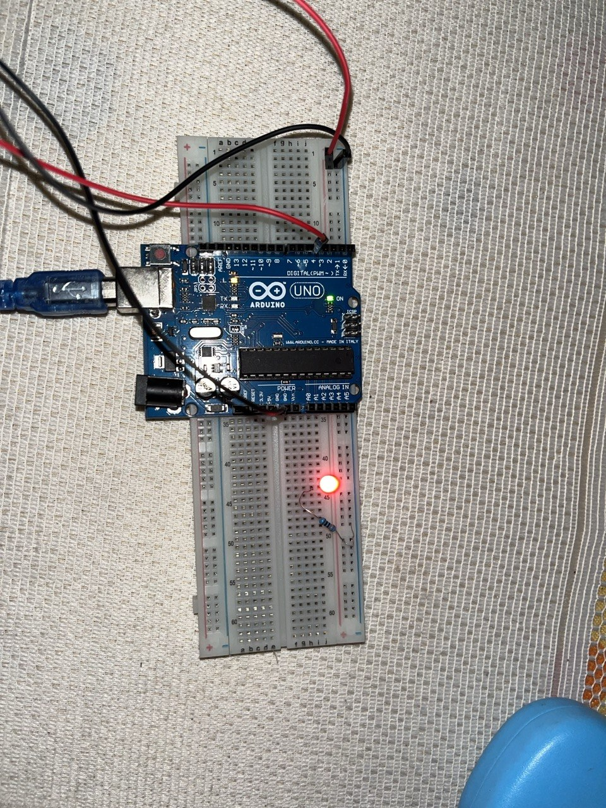
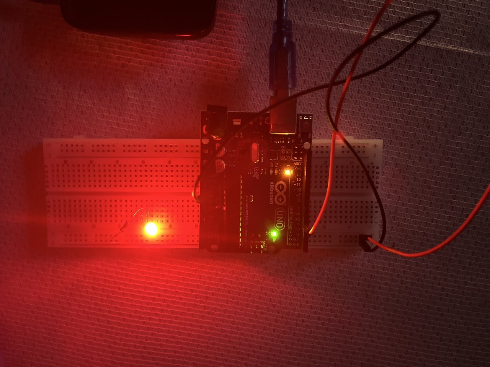

# 01 - LED Blink

First Arduino project - blinking a single LED.

## Components
- Arduino UNO R3
- 1 LED
- 1 x 220 ohm resistor
- Breadboard + jumper wires

## Circuit

LED + 220 ohm resistor on pin 4.
Anode (long leg) to pin through resistor, cathode (short leg) to GND.

## What I learned
- Ohm's law: V = R x I (why 220 ohm protects the LED on 5V)
- How a breadboard works (internal connections, power rails)
- setup() runs once, loop() runs forever
- pinMode(), digitalWrite(), delay()
- delay() pauses in milliseconds (1000 = 1 second)
- Programs persist in Flash memory after power off
- Removing delay() makes the LED blink too fast for the eye to see
