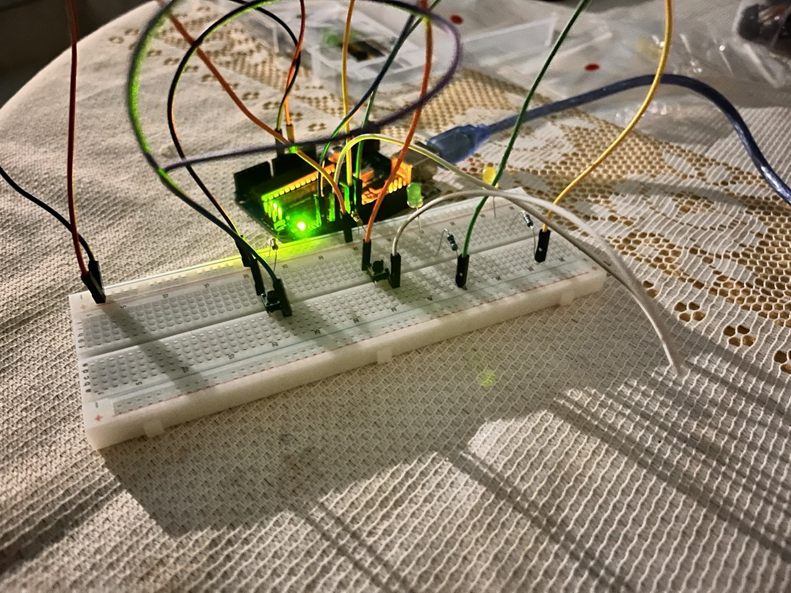

# 02 - Button LED Control

Digital inputs with push buttons - each button toggles its own LED.

## Components
- Arduino UNO R3
- 2 push buttons
- 2 x 1K ohm resistors (pull-down)
- 2 LEDs
- 2 x 220 ohm resistors
- Breadboard + jumper wires

## Circuit

- Button 1 on pin 2 with 1K pull-down to GND → toggles LED 1 on pin 7
- Button 2 on pin 4 with 1K pull-down to GND → toggles LED 2 on pin 8
- Each LED with 220 ohm resistor to GND

## What I learned
- A floating pin (connected in code but not on the breadboard) causes unpredictable behavior
- Pull-down resistors (1K) bring the pin voltage to 0V when the button is released, ensuring a clean LOW reading
- A component can only be controlled if it is physically connected to a pin
- State variables (bool) to remember whether a LED is on or off across loop cycles
- Rising-edge detection: comparing current state vs last state to detect the exact moment of a button press
- Serial.println() is the primary debug tool in embedded - it reveals what the Arduino actually reads
- Hardware debugging: when behavior is wrong, check the circuit first with Serial monitor before blaming the code
- Buttons too close on the breadboard cause interference - spacing matters
- The ternary operator: condition ? value_if_true : value_if_false
