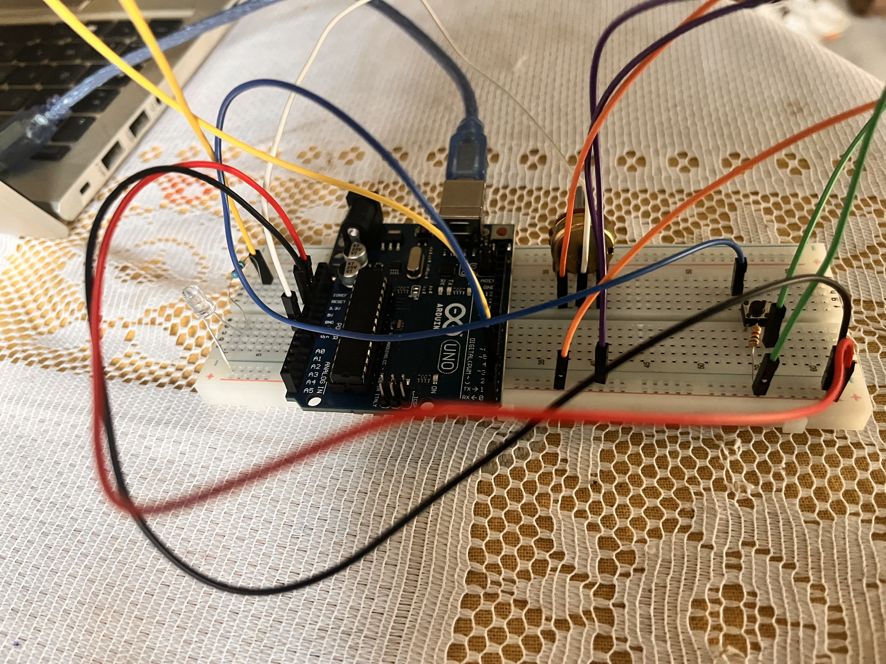

# 03 - Analog Input & PWM

Potentiometer controls LED brightness with a button on/off toggle.

## Components
- Arduino UNO R3
- 1 potentiometer 10K ohm
- 1 LED
- 1 x 220 ohm resistor
- 1 push button
- 1 x 1K ohm resistor (pull-down)
- Breadboard + jumper wires

## Circuit

- Potentiometer on A0 (left leg 5V, middle leg A0, right leg GND)
- LED on pin 3 (PWM) with 220 ohm resistor to GND
- Button on pin 2 with 1K pull-down to GND

## What I learned
- analogRead() returns values 0-1023 (10-bit ADC)
- analogWrite() accepts values 0-255 (8-bit PWM)
- map() converts between value ranges (0-1023 to 0-255)
- PWM simulates analog output by switching pin on/off thousands of times per second
- Analog pins (A0-A5) don't need pinMode() - they default to analog input
- A potentiometer is a variable resistor - controls current without any code
- Without Arduino, a potentiometer can directly dim an LED (pure analog circuit)
- The breadboard has no power - always connect 5V and GND wires first
- lastButtonState must be updated at end of loop() for edge detection to work
