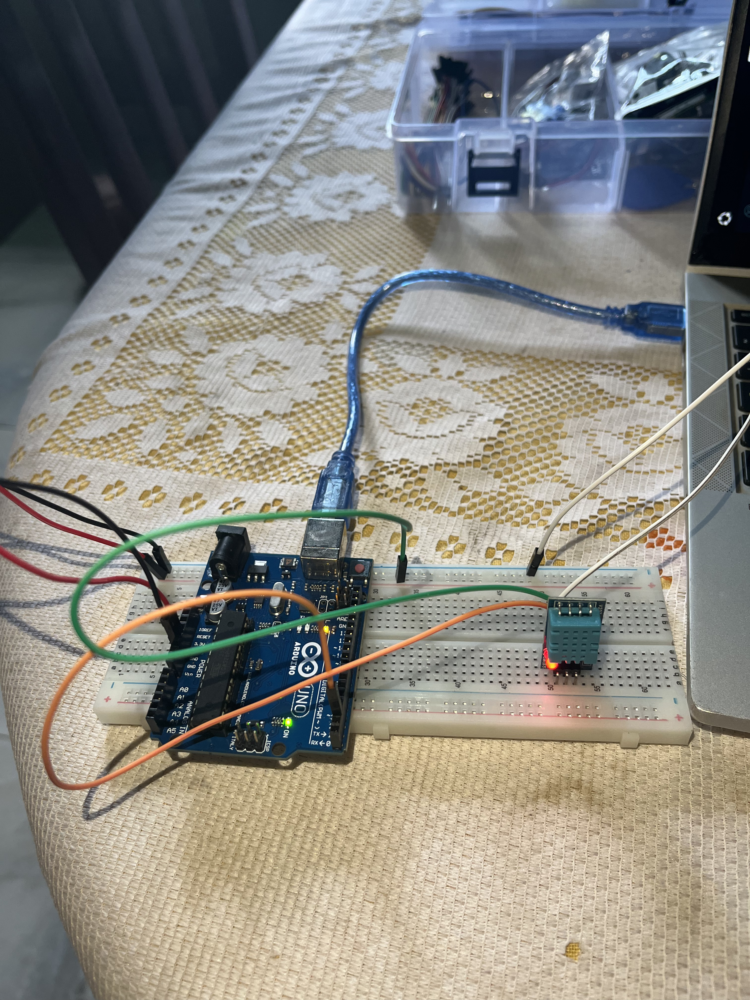
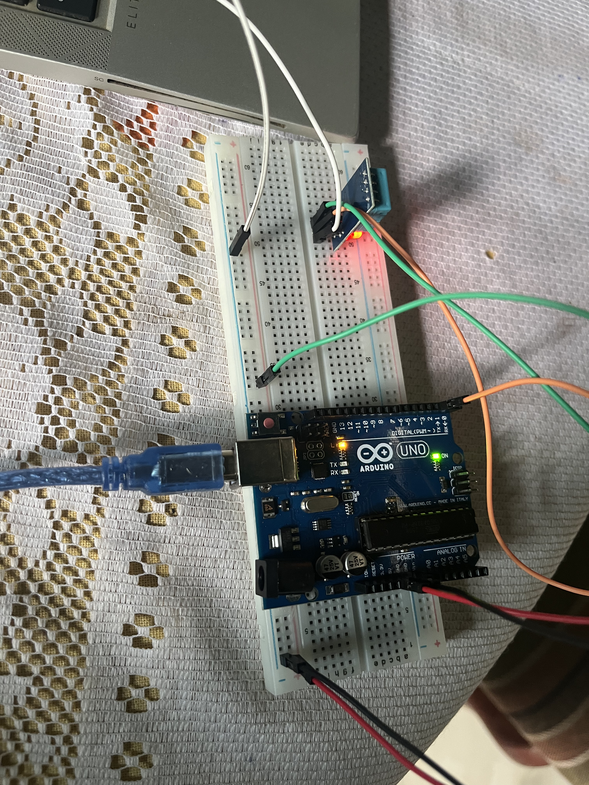

# 05 - DHT11 Temperature & Humidity Sensor

Reading temperature and humidity with the DHT11 digital sensor.

## Components
- Arduino UNO R3
- DHT11 sensor module (3 pins)
- Breadboard + jumper wires

## Circuit

- DHT11 VCC → 5V
- DHT11 DATA → pin 2
- DHT11 GND → GND

Note: 3-pin module has built-in pull-up resistor.
No external resistor needed.

## Libraries
- DHT sensor library by Adafruit
- Adafruit Unified Sensor

## What I learned
- DHT11 is a digital sensor - returns processed values directly
- No need to calculate like with a raw thermistor
- nan output = wiring problem or wrong pull-up configuration
- 3-pin DHT11 module has built-in pull-up - external resistor causes conflict
- DHT11 needs 2 seconds minimum between readings (delay 2000)
- float type for decimal values (23.5°C) vs int for whole numbers
- Temperature measured by internal thermistor
- Humidity measured by capacitive sensor with hygroscopic material
- The photovoltaic effect liberates electrons in CdS (photoresistor)
- DHT11 has its own internal microcontroller - smarter than a raw sensor
