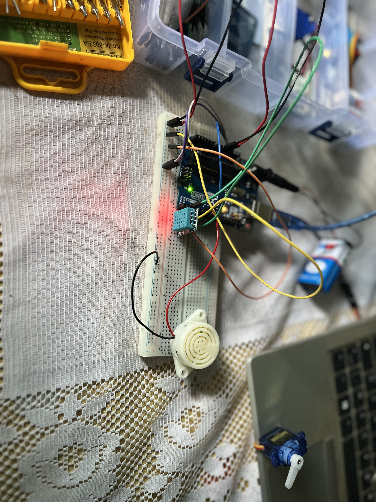

# 06- Temperature Alert System

A temperature monitoring system that triggers both audible and physical alerts when a threshold is exceeded. Combines the DHT11 sensor (from Session 05) with a passive buzzer and a continuous rotation servo motor.

## Components

- Arduino UNO R3
- DHT11 temperature/humidity sensor (module)
- Passive piezo buzzer
- Continuous rotation servo motor (SG90-labeled)
- 9V battery + DC jack (supplemented with USB for sufficient current)
- Jumper wires

## Circuit

| Component | Pin | Arduino / Rail |
|-----------|-----|----------------|
| DHT11 VCC | + | 5V rail |
| DHT11 GND | - | GND rail |
| DHT11 DATA | S | Pin 2 |
| Buzzer (+) | | Pin 8 |
| Buzzer (-) | | GND rail |
| Servo (red) | | 5V rail |
| Servo (brown/black) | | GND rail |
| Servo (orange/yellow) | | Pin 6 |

## How It Works

1. The DHT11 reads the ambient temperature every 2.5 seconds
2. If the temperature exceeds the threshold (default: 30°C for testing, 38°C for deployment), the system triggers an alert:
   - The buzzer sounds a 262 Hz tone (middle C) for 1 second
   - The servo motor spins at full speed as a visual/mechanical indicator
3. When the temperature drops below the threshold:
   - The buzzer goes silent
   - The servo stops (write(90) = neutral on continuous rotation servo)

## Key Concepts Learned

- **Passive buzzer control**: `tone(pin, frequency, duration)` generates a square wave at the specified frequency. `noTone()` stops it. Unlike an active buzzer, the passive type requires the microcontroller to generate the frequency.
- **Continuous rotation servo**: Unlike a standard servo that moves to a fixed angle, a continuous rotation servo interprets `write()` as speed/direction — 90 = stop, 0 = full speed one way, 180 = full speed the other way.
- **Servo/DHT11 timer conflict**: The Servo library uses hardware timer interrupts that corrupt the DHT11's microsecond-precision one-wire protocol. Solution: `attach()` before `write()`, short `delay(500)`, then `detach()` to release the timer before reading the sensor.
- **Power budget management**: A 9V battery provides correct voltage but insufficient current (~200-300 mA) for a servo under load. USB supplementation or a dedicated servo power supply (with shared GND) is required. Brownout resets are a common symptom of insufficient current — difficult to diagnose because the code appears correct.
- **`isnan()` guard**: The DHT11 returns NaN on failed reads. Without a guard, comparisons like `temperature >= 38` behave unpredictably with NaN values.

## Security Angle

Servo motors are used in physical access control — hotel locks, smart lockers, IoT door locks. In this project, the servo signal (PWM on pin 6) is unencrypted and unauthenticated. Anyone with a microcontroller and a jumper wire could send their own pulse to the servo's signal line and override the system. Real-world cheap IoT locks have been compromised exactly this way — not through software exploits, but by injecting raw PWM signals. Buzzer-based alarms face a similar risk: cutting the signal line or crashing the firmware silently disables the alert.

## Debugging Notes

- Servo spinning continuously at all angles → it's a continuous rotation servo, not a standard positional servo, despite SG90 labeling
- Serial output showing garbled characters (□□□) → brownout resets from insufficient power supply
- Bursts of NaN readings → servo timer interfering with DHT11; resolved by detaching servo before sensor reads
