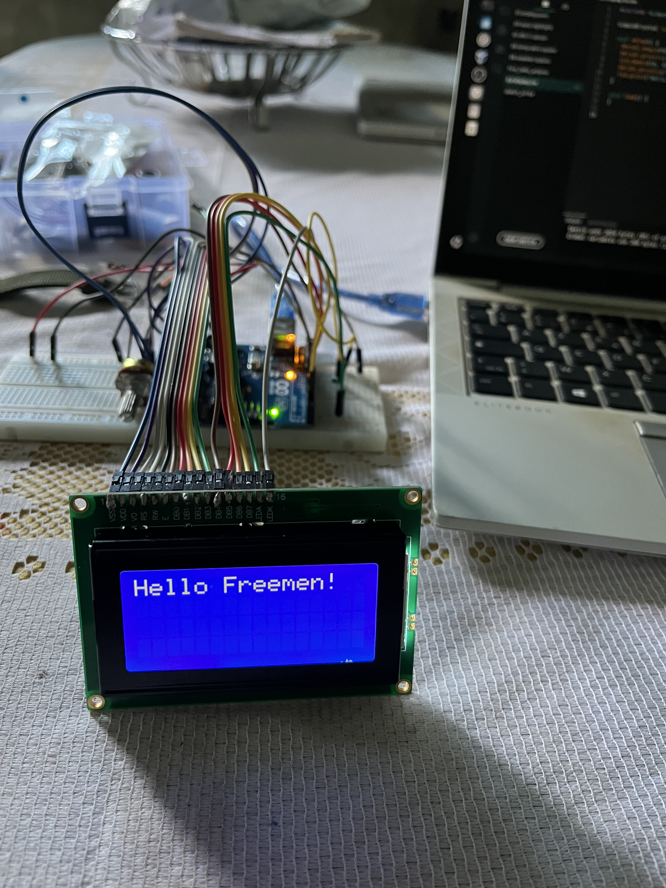

# 07 - LCD 16x4 Display

First project using a character display — a LCM1604A 16x4 LCD driven by the HD44780 controller in 4-bit mode. Displays a welcome message on boot, a live counter incrementing every second, and a real-time potentiometer reading.

## Components

- Arduino UNO R3
- LCM1604A 16x4 LCD display (HD44780 controller)
- 10kΩ potentiometer (contrast adjustment)
- 220Ω resistor (backlight protection)
- Jumper wires

## Circuit

| LCD Pin | Function | Connection |
|---------|----------|------------|
| 1 (VSS) | Ground | GND rail |
| 2 (VDD) | Power | 5V rail |
| 3 (V0) | Contrast | Potentiometer cursor |
| 4 (RS) | Register Select | Pin 12 |
| 5 (RW) | Read/Write | GND rail |
| 6 (EN) | Enable | Pin 11 |
| 7-10 (D0-D3) | Data (unused) | Not connected |
| 11 (D4) | Data bit 4 | Pin 5 |
| 12 (D5) | Data bit 5 | Pin 4 |
| 13 (D6) | Data bit 6 | Pin 3 |
| 14 (D7) | Data bit 7 | Pin 2 |
| 15 (LED+) | Backlight anode | 5V via 220Ω |
| 16 (LED-) | Backlight cathode | GND rail |

**Potentiometer:** left leg → GND, right leg → 5V, cursor → LCD V0.

## How It Works

1. On boot, "Hello Freemen!" displays for 3 seconds, then the screen clears
2. Line 2 shows a counter incrementing every second using `millis()` (non-blocking)
3. Line 3 shows the live `analogRead(A0)` value from the potentiometer (0–1023)
4. The counter and potentiometer update independently - `millis()` keeps the counter ticking while the potentiometer refreshes every loop cycle

## Key Concepts Learned

- **4-bit mode**: The HD44780 can receive data as two 4-bit nibbles instead of one 8-bit byte. This uses 6 Arduino pins (RS, EN, D4-D7) instead of 10 - critical when pins are limited. D0-D3 are left unconnected, not grounded.
- **RS (Register Select)**: RS = 0 sends a command (clear screen, move cursor). RS = 1 sends a character to display. The LCD interprets the same data differently based on this single pin.
- **EN (Enable)**: A brief HIGH pulse tells the LCD to read the data lines. Without this pulse, the LCD ignores everything on D4-D7.
- **RW grounded**: Permanently set to write mode. Reading from the LCD is possible but unnecessary for typical projects.
- **Contrast calibration**: V0 voltage controls pixel visibility. Near 0V = maximum contrast, near 5V = invisible. If the screen appears blank after correct wiring, the potentiometer is the first thing to check.
- **`millis()` over `delay()`**: Using `delay(1000)` for the counter would freeze the entire loop - the potentiometer couldn't update during the pause. `millis()` lets both run concurrently.
- **Display residue**: When a number shrinks in digits (100 → 99), the last character of the old value stays on screen. Appending spaces after `lcd.print()` overwrites stale characters. `lcd.clear()` works but causes visible flicker.
- **`lcd.begin(16, 4)`**: Must match the physical display. Using `lcd.begin(16, 2)` on a 16x4 display causes missing lines.
- **Pin flexibility**: RS, EN, D4-D7 can connect to any digital pin. The constructor `LiquidCrystal(RS, EN, D4, D5, D6, D7)` maps the physical wiring  mismatch causes garbled output or silence.

## Debugging Notes

- LCD showing rectangles but no text → header pins were not soldered to the LCD module. Jumper wires inserted into bare through-holes made contact for power (continuous current) but failed for data signals (microsecond pulses). Soldering the header pins permanently resolved this.
- LCD blank after uploading new code → jumper wire not fully seated in breadboard row.
- RS pin showing intermittent continuity on multimeter test → weak contact confirmed as root cause of failed LCD initialization. Reseating the wire fixed it.
- Screen blank, Serial monitor shows "Demarrage" and "LCD init OK" → code runs past `lcd.begin()` but data never reaches the LCD. Always a wiring issue on the 6 data/control lines when this happens.

## Security Angle

LCD displays are embedded in ATMs, point-of-sale terminals, access control panels, and industrial HMIs. The HD44780 protocol has no authentication , the display shows whatever the controller sends. An attacker with physical access to the data lines (RS, EN, D4-D7) can inject arbitrary content: displaying "Transaction Approved" on a compromised payment terminal, or "Access Granted" on a tampered door panel. In secure deployments, the communication between microcontroller and display must be protected - either through physical enclosure tamper detection or encrypted display protocols used in modern secure terminals.
