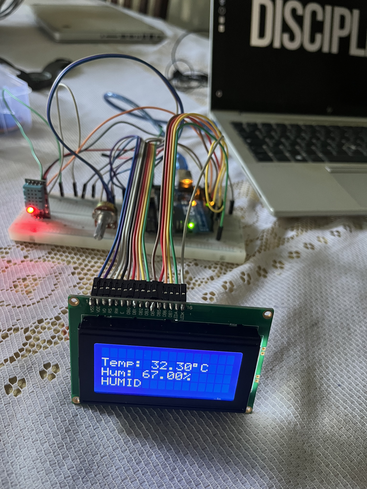

# 08 - Weather Station

A real-time weather station displaying temperature, humidity, and comfort level on a 16x4 LCD screen. Combines the DHT11 sensor (Session 05) with the LCM1604A LCD display (Session 06) into a standalone monitoring device.

## Components

- Arduino UNO R3
- DHT11 temperature/humidity sensor (module with built-in pull-up)
- LCM1604A 16x4 LCD display (HD44780 controller, 4-bit mode)
- 10kΩ potentiometer (LCD contrast adjustment on V0)
- 220Ω resistor (LCD backlight protection)
- Jumper wires

## Circuit

| Component | Pin | Arduino / Rail |
|-----------|-----|----------------|
| LCD VSS (pin 1) | | GND rail |
| LCD VDD (pin 2) | | 5V rail |
| LCD V0 (pin 3) | | Potentiometer cursor |
| LCD RS (pin 4) | | Pin 12 |
| LCD RW (pin 5) | | GND rail |
| LCD EN (pin 6) | | Pin 11 |
| LCD D4 (pin 11) | | Pin 5 |
| LCD D5 (pin 12) | | Pin 4 |
| LCD D6 (pin 13) | | Pin 3 |
| LCD D7 (pin 14) | | Pin 2 |
| LCD LED+ (pin 15) | | 5V via 220Ω |
| LCD LED- (pin 16) | | GND rail |
| DHT11 VCC | | 5V rail |
| DHT11 GND | | GND rail |
| DHT11 DATA | | Pin 7 |
| Pot left leg | | GND rail |
| Pot right leg | | 5V rail |
| Pot cursor | | LCD V0 |

**Note:** DHT11 DATA is on pin 7 to avoid conflict with LCD D7 on pin 2.

## How It Works

1. The system displays a startup message ("Weather Station") for 2 seconds
2. The DHT11 reads temperature and humidity every 2 seconds
3. Data is displayed across the 4 LCD lines:
   - Line 1: Startup message (cleared after boot)
   - Line 2: Temperature in °C
   - Line 3: Humidity in %
   - Line 4: Comfort level — DRY (<40%), COMFORT (40-60%), or HUMID (>60%)
4. Failed sensor reads are caught by `isnan()` and the loop retries

## Key Concepts Learned

- **HD44780 4-bit mode**: Sends each byte as two 4-bit nibbles over D4-D7, using 6 Arduino pins instead of 10. The LiquidCrystal library handles the split automatically.
- **LCD pin flexibility**: RS, EN, D4-D7 can connect to any digital pin — the constructor `LiquidCrystal(RS, EN, D4, D5, D6, D7)` maps the physical wiring to software. Mismatches cause garbled output or blank screen.
- **Contrast calibration**: V0 voltage (via potentiometer) controls pixel contrast. If the screen appears blank after correct wiring, turning the potentiometer slowly is the first debugging step.
- **Pin conflict awareness**: Both the LCD (D7) and DHT11 (DATA) originally needed a digital pin — assigning them to the same pin caused permanent read failures. Separating them (pin 2 for LCD, pin 7 for DHT11) resolved the issue.
- **Character encoding**: The HD44780 uses its own character table. UTF-8 `°` does not render correctly — use `lcd.write(0xDF)` for the degree symbol.
- **Display residue**: When a displayed value shrinks in digit count (e.g., 1023 → 50), leftover characters remain on screen. Appending spaces after `lcd.print()` overwrites stale characters without the flicker caused by `lcd.clear()`.
- **LCM1604A identification**: Checking the label on the back of the LCD revealed a 16x4 display, not 16x2 — requiring `lcd.begin(16, 4)` instead of `lcd.begin(16, 2)`.

## Debugging Notes

- LCD showing rectangles but no text → pins not soldered / poor breadboard contact on data lines (RS, EN, D4-D7). Continuity test with multimeter confirmed weak RS connection.
- DHT11 returning only NaN → sensor not powered (VCC/GND disconnected after circuit rearrangement)
- Blank LCD after uploading new code → jumper wire not fully inserted in breadboard
- Degree symbol displaying as garbage → replaced UTF-8 `°` with HD44780 native `0xDF`

## Security Angle

IoT weather stations are deployed in agriculture, pharmaceutical storage, and datacenter monitoring. The DHT11 transmits data over a single unauthenticated wire using a timing-based protocol with a trivial checksum (sum of 4 bytes). An attacker with physical access could inject false temperature readings on the DATA line — a sensor spoofing attack — to suppress cooling alerts in a datacenter or falsify storage conditions in a pharmaceutical warehouse. In production systems, signed sensor data and tamper-evident enclosures mitigate this vector.
